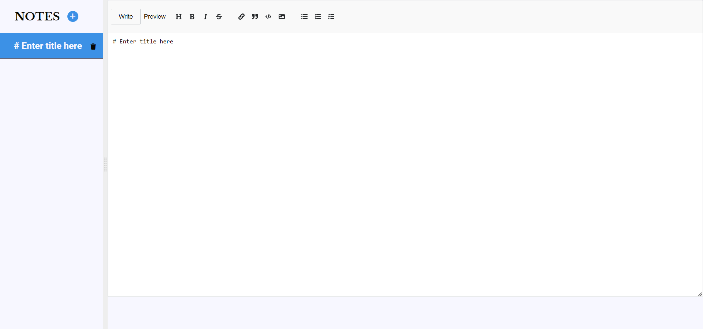

# Notepad | React Markdown Editor

This is a markdown editor made with React. This is a follow-up project of [freeCodeCamp ft Scrimba's React tutorial course](https://youtu.be/bMknfKXIFA8).

## Table of contents

- [Overview](#overview)
  - [Screenshot](#screenshot)
  - [Links](#links)
- [My process](#my-process)
  - [Built with](#built-with)
  - [What I learned](#what-i-learned)
  - [Continued development](#continued-development)
  - [Useful resources](#useful-resources)
- [Author](#author)
- [Acknowledgments](#acknowledgments)

## Overview

### Screenshot

### Links

- Live Site URL: [https://Drougnov.github.io/Notepad](https://Drougnov.github.io/Notepad)

## My process

### Built with

- Semantic HTML5 markup
- CSS custom properties
- Flexbox
- [React](https://reactjs.org/) - JS library

### What I learned

- How to handle input values with React

- How to fetch api data with React

### Continued development

- Adding responsiveness

- Update UI

### Useful resources

- [Scrimba's React crash course](https://youtu.be/bMknfKXIFA8)
- [tackOverFlow](https://www.stackoverflow.com)

## Author

- Frontend Mentor - [@BIPLOB BARUA](https://www.frontendmentor.io/profile/Drougnov)
- Facebook - [@Biplob Barua Rocky](https://www.facebook.com/ANT1D0t35)

## Acknowledgments

I would be glad if you can leave out some suggestion on how I can improve my code.
